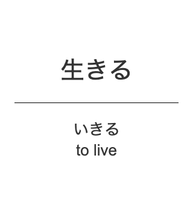

# open-anki-jlpt-decks

Open source and updatable JLPT Anki Decks. You can help improve and maintain the notes contained for everyone!

The notes are stored in csv files to allow easy editing and reviewing of changes. Newer decks will be generated from any changes.

| Question Template | Answer Template |
| :---: | :---: |
|  |  |

## Installation (WIP)

Todo: Upload to ankiweb and share. Can we automate this?

## Guiding Principles

Use these principles to help guide changes to the project.

1. Card [questions and answers are as atomic as possible](http://augmentingcognition.com/ltm.html). Expressing one idea.
1. Card design is minimal and does not distract from the information
1. Only content relevant for active recall is present on the card

## How to contribute to the project?

Please see the [contributing document.](CONTRIBUTING.md)

## Acknowledgements
Original deck data was taken from https://github.com/chyyran/jlpt-anki-decks,
which were based on decks from tanos.co.uk
