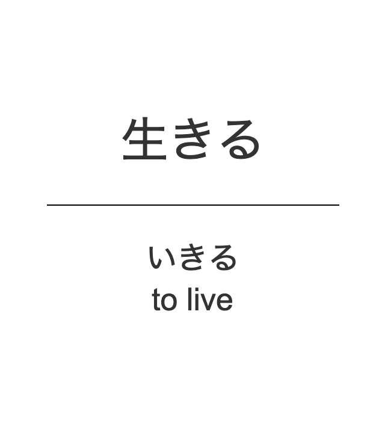
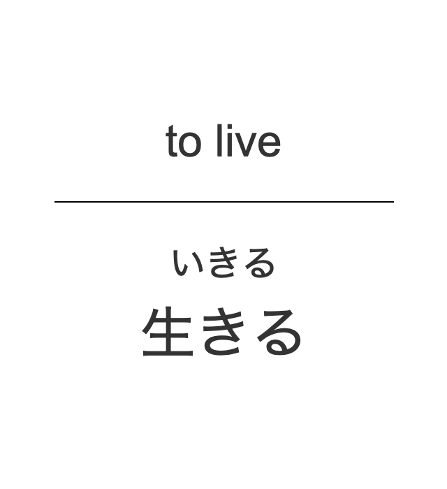

# open-anki-jlpt-decks

Open source and updatable JLPT vocabulary Anki decks from N1 to N5.

This project solves many problems with existing anki decks that grow stale. This deck gives **you** the **power** to help everyone.
- Notice a mistake? Easy you can fix it 💪
- Missing relevant JLPT vocab? Send us a reputable source and let's add it 🤓
- Ideas for improving the design and look of cards? Help us design it 👩‍🎨

The notes are stored in csv files to allow easy editing and reviewing of changes. Newer decks will be generated from any changes.

| Question Template | Answer Template |
| :---: | :---: |
|  |  |
|  |  |

## Installation

### Ankiweb

The shared decks can be found on [Ankiweb's shared decks.](https://ankiweb.net/shared/decks/Open%20Anki%20JLPT)

Use the search term _"Open Anki JLPT"_ for best search result.

The downloaded file can then be imported into your Anki app of choice (Anki Desktop, Ankidroid etc.).

### Manual download

The `apkg` files can be downloaded directly from the [latest release page](https://github.com/jamsinclair/open-anki-jlpt-decks/releases/latest) and imported into your Anki app of choice.

## Guiding Principles

Use these principles to help guide changes to the project.

1. Card [questions and answers are as atomic as possible](http://augmentingcognition.com/ltm.html). Expressing one idea.
1. Card design is minimal and does not distract from the information
1. Only content relevant for active recall is present on the card

## How to contribute to the project?

Please see the [contributing document.](CONTRIBUTING.md)

## Acknowledgements
Original deck data was taken from https://github.com/chyyran/jlpt-anki-decks,
which were based on decks from tanos.co.uk
